# AWS Self-Healing Infrastructure

## Project Overview

This project demonstrates the implementation of a self-healing infrastructure workflow on AWS.

The solution monitors an Nginx web application hosted on Amazon EC2 using CloudWatch Synthetics Canary. When the website becomes unavailable, a CloudWatch Alarm detects the failure and triggers an EventBridge rule. EventBridge invokes an AWS Lambda function, which uses AWS Systems Manager Run Command to restart the Nginx service automatically.

This project follows Site Reliability Engineering (SRE) principles by focusing on automated detection, alerting, and remediation of service failures.

## Architecture

```text
User
  |
  v
Nginx Web Application on EC2
  |
  v
CloudWatch Synthetics Canary
  |
  v
SuccessPercent Metric
  |
  v
CloudWatch Alarm
  |
  v
EventBridge Rule
  |
  v
AWS Lambda Function
  |
  v
Systems Manager Run Command
  |
  v
Restart Nginx Service
  |
  v
Website Restored
```
## AWS Services Used

| Service               | Purpose                                              |
| --------------------- | ---------------------------------------------------- |
| Amazon EC2            | Hosted the Nginx web application                     |
| Nginx                 | Web server used for application hosting              |
| CloudWatch Synthetics | Monitored website availability using a Canary        |
| CloudWatch Alarm      | Detected website failure using SuccessPercent metric |
| Amazon SNS            | Sent email notifications during alarm state          |
| EventBridge           | Routed alarm state change events to Lambda           |
| AWS Lambda            | Executed automated recovery logic                    |
| AWS Systems Manager   | Remotely executed service restart command on EC2     |
| IAM                   | Managed permissions for Lambda, SSM, and EC2         |

## Key Features

* Website availability monitoring using CloudWatch Synthetics Canary
* CloudWatch Alarm based on SuccessPercent metric
* Event-driven automation using Amazon EventBridge
* Lambda-based remediation workflow
* Remote service recovery using Systems Manager Run Command
* Automated restart of Nginx service without SSH
* End-to-end failure simulation and recovery validation
* SNS notification integration for incident visibility

## Implementation Summary

1. Hosted an Nginx web application on Amazon EC2.
2. Verified Systems Manager Agent was running on the EC2 instance.
3. Attached `AmazonSSMManagedInstanceCore` policy to allow EC2 management through Systems Manager.
4. Registered the EC2 instance as an online managed node in Systems Manager Fleet Manager.
5. Validated Systems Manager Run Command by remotely stopping and starting Nginx.
6. Created an AWS Lambda function to execute SSM Run Command.
7. Granted Lambda permission to interact with Systems Manager.
8. Created a CloudWatch Synthetics Canary to monitor website availability.
9. Created a CloudWatch Alarm on the Canary `SuccessPercent` metric.
10. Created an EventBridge rule to detect when the alarm enters `ALARM` state.
11. Configured EventBridge to trigger the Lambda function.
12. Simulated Nginx failure and validated automatic recovery.

## Self-Healing Workflow

```text
Nginx Service Stops
      |
      v
Website Becomes Unavailable
      |
      v
CloudWatch Canary Fails
      |
      v
SuccessPercent Drops Below 100
      |
      v
CloudWatch Alarm Enters ALARM State
      |
      v
EventBridge Captures Alarm State Change
      |
      v
Lambda Function Executes
      |
      v
SSM Run Command Starts Nginx
      |
      v
Website Becomes Available Again
```
## Validation Performed

### Failure Simulation

Nginx was manually stopped to simulate an application failure:

```
sudo systemctl stop nginx
```
### Expected Result

* Website became unavailable
* Canary failed
* CloudWatch Alarm entered ALARM state
* EventBridge triggered Lambda
* Lambda invoked Systems Manager Run Command
* Nginx restarted automatically
* Website became available again

### Final Verification

```
sudo systemctl status nginx
```

Expected output:

```text
active (running)
```

## Results

Successfully implemented a self-healing AWS workflow capable of detecting and automatically recovering from application-level service failure.

The solution reduced manual intervention by automatically restarting the failed Nginx service through Lambda and Systems Manager.

## Key Learnings

* CloudWatch Synthetics Canary monitoring
* Availability-based alerting
* EventBridge event routing
* Lambda automation using Python and boto3
* Systems Manager Run Command
* IAM role troubleshooting
* Automated incident remediation
* SRE self-healing infrastructure concepts

## Project Walkthrough

### EC2 Instance Running

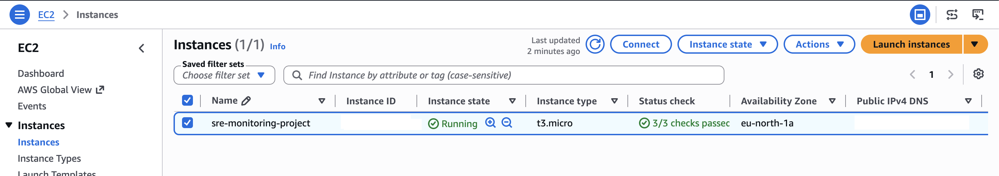

### Website Healthy

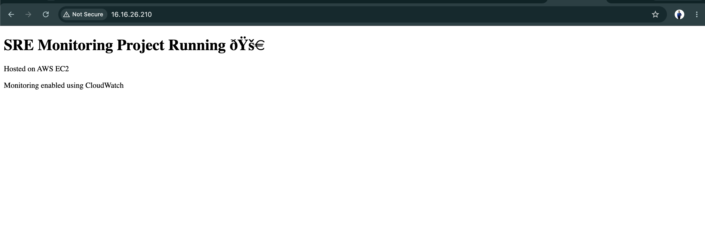

### Canary Passed

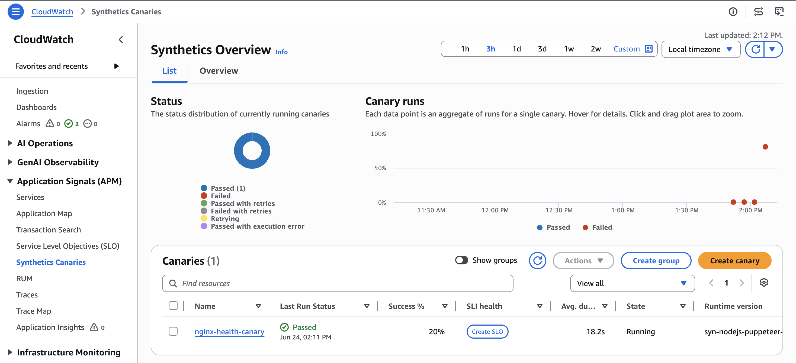

### Alarm OK

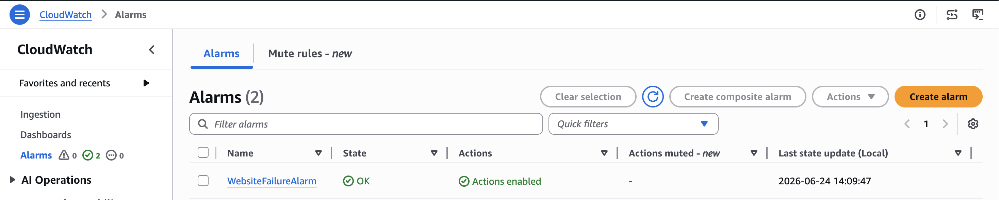

### EventBridge Rule

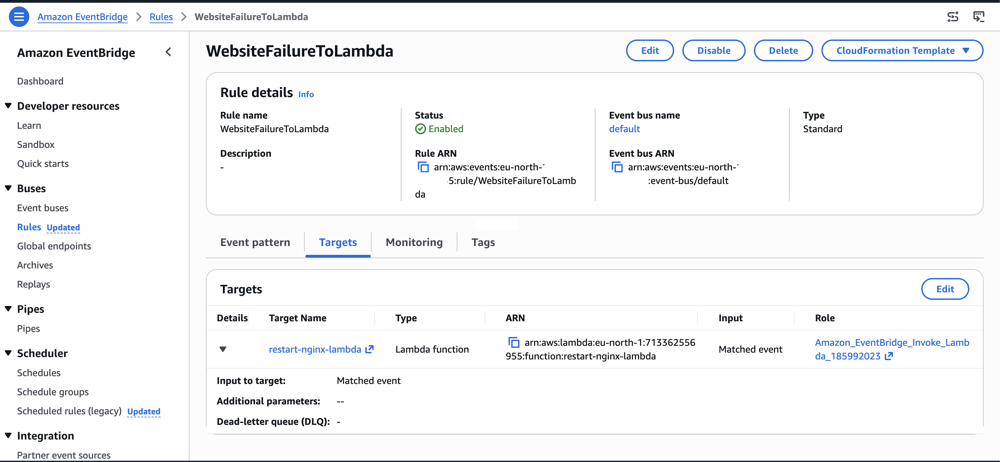

### Lambda Function

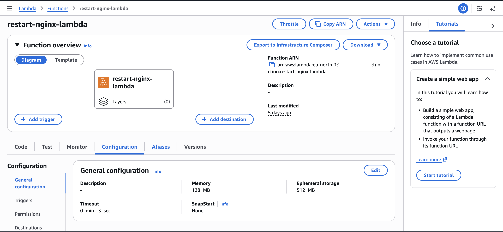

### SSM Managed Node

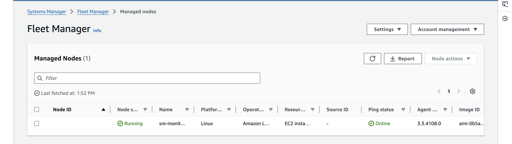

### Website Failure

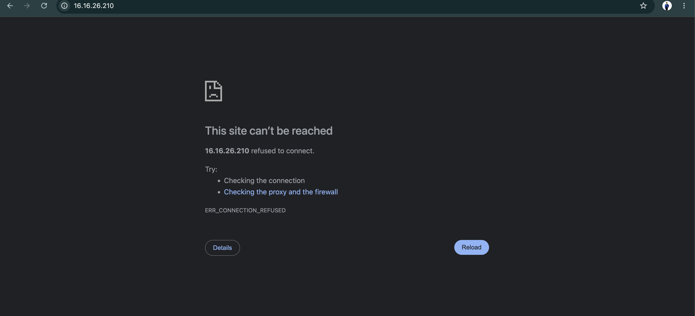

### Canary Failure Detection

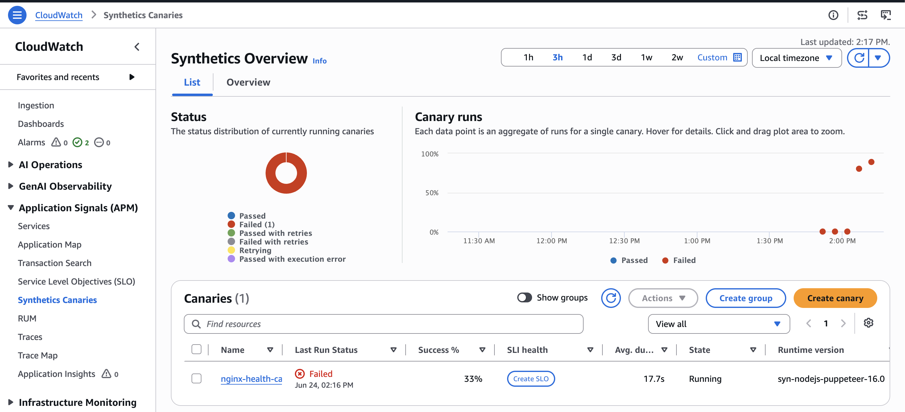

### Alarm Triggered

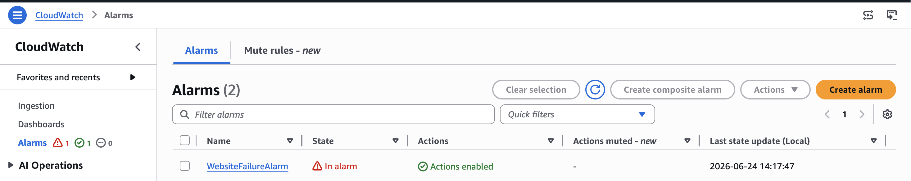

### Lambda Invocation

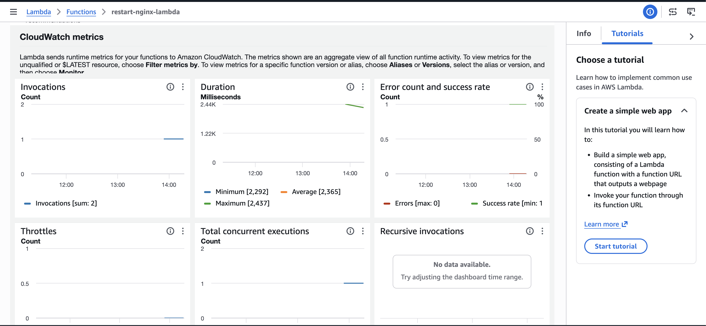

### SSM Automated Remediation

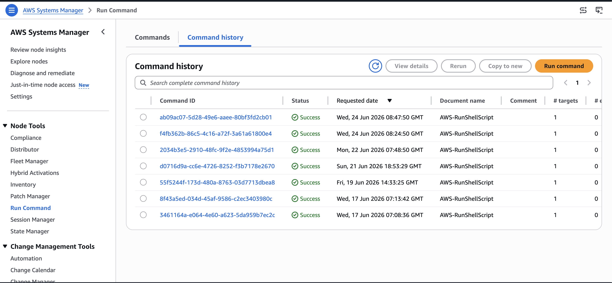

### Website Recovered

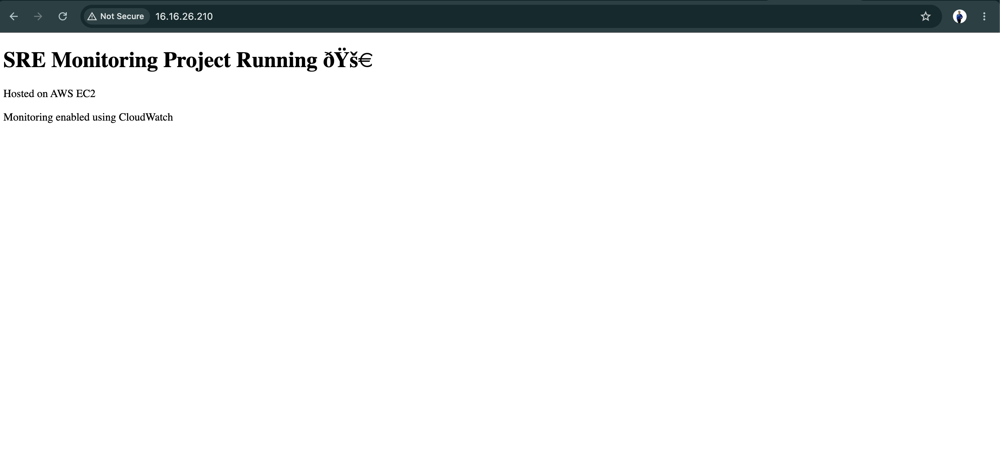

### Canary Recovered

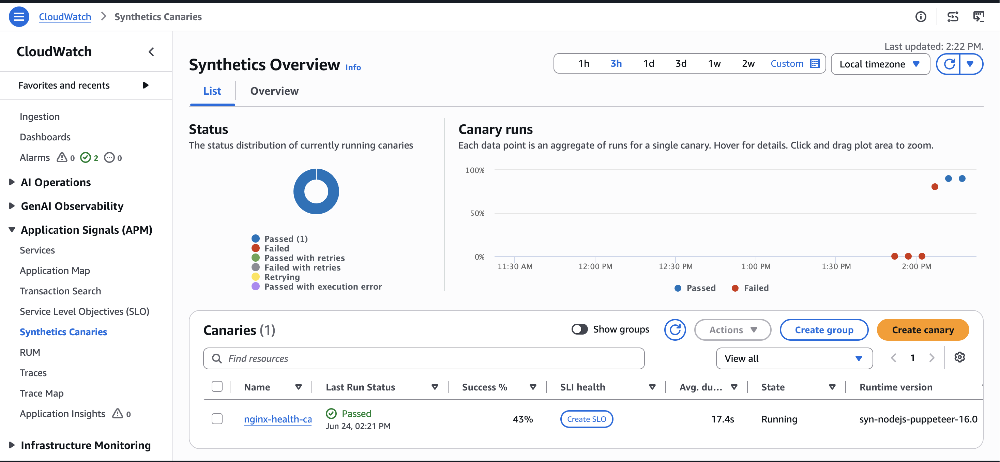

### Alarm Recovered

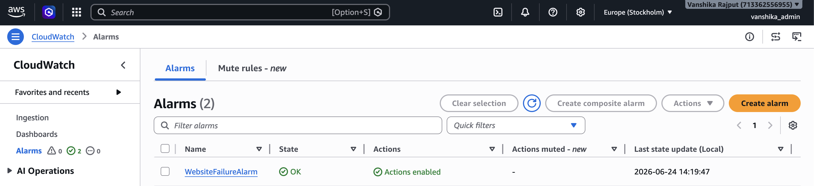

### CloudWatch Dashboard

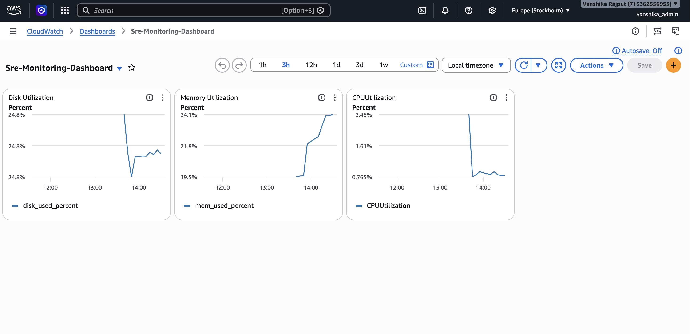

